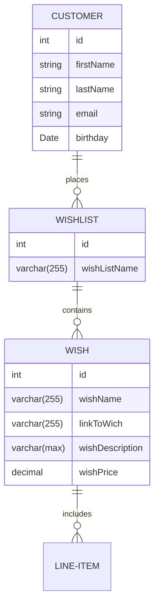

```mermaid
erDiagram
    CUSTOMER ||--o{ WISHLIST : places
    WISHLIST ||--o{ WISH : contains
    WISH ||--o{ LINE-ITEM : includes
    CUSTOMER {
        int id 
        string firstName
        string lastName
        string email
        Date birthday
        
    }
    WISHLIST {
        int id
        varchar(255) wishListName
    }
    WISH {
        int id
        varchar(255) wishName
        varchar(255) linkToWich
        varchar(max) wishDescription 
        decimal wishPrice
    }
    
```
