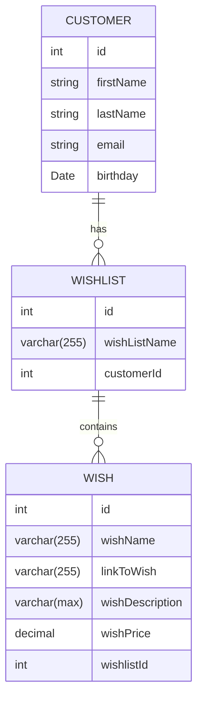

```mermaid
erDiagram
    CUSTOMER {
        int id 
        string firstName
        string lastName
        string email
        Date birthday
    }
    WISHLIST {
        int id
        varchar(255) wishListName
        int customerId
    }
    WISH {
        int id
        varchar(255) wishName
        varchar(255) linkToWish
        varchar(max) wishDescription 
        decimal wishPrice
        int wishlistId
    }
    
    CUSTOMER ||--o{ WISHLIST : has
    WISHLIST ||--o{ WISH : contains

    
```
