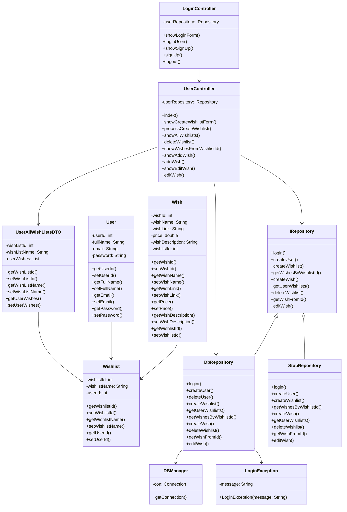

```mermaid
classDiagram
class LoginController {
  +showLoginForm()
  +loginUser()
  +showSignUp()
  +signUp()
  +logout()
  -userRepository: IRepository
}

class UserController {
  +index()
  +showCreateWishlistForm()
  +processCreateWishlist()
  +showAllWishlists()
  +deleteWishlist()
  +showWishesFromWishlistId()
  +showAddWish()
  +addWish()
  +showEditWish()
  +editWish()
  -userRepository: IRepository
}

class UserAllWishListsDTO {
  +getWishListId()
  +setWishListId()
  +getWishListName()
  +setWishListName()
  +getUserWishes()
  +setUserWishes()
  -wishListId: int
  -wishListName: String
  -userWishes: List<Wish>
}

class User {
  +getUserId()
  +setUserId()
  +getFullName()
  +setFullName()
  +getEmail()
  +setEmail()
  +getPassword()
  +setPassword()
  -userId: int
  -fullName: String
  -email: String
  -password: String
}

class Wish {
  +getWishId()
  +setWishId()
  +getWishName()
  +setWishName()
  +getWishLink()
  +setWishLink()
  +getPrice()
  +setPrice()
  +getWishDescription()
  +setWishDescription()
  +getWishlistId()
  +setWishlistId()
  -wishId: int
  -wishName: String
  -wishLink: String
  -price: double
  -wishDescription: String
  -wishlistId: int
}

class Wishlist {
  +getWishlistId()
  +setWishlistId()
  +getWishlistName()
  +setWishlistName()
  +getUserId()
  +setUserId()
  -wishlistId: int
  -wishlistName: String
  -userId: int
}

class IRepository {
  +login()
  +createUser()
  +createWishlist()
  +getWishesByWishlistId()
  +createWish()
  +getUserWishlists()
  +deleteWishlist()
  +getWishFromId()
  +editWish()
}

class DbRepository {
  +login()
  +createUser()
  +deleteUser()
  +createWishlist()
  +getUserWishlists()
  +getWishesByWishlistId()
  +createWish()
  +deleteWishlist()
  +getWishFromId()
  +editWish()
}

class StubRepository {
  +login()
  +createUser()
  +createWishlist()
  +getWishesByWishlistId()
  +createWish()
  +getUserWishlists()
  +deleteWishlist()
  +getWishFromId()
  +editWish()
}

class DBManager {
  +getConnection()
  -con: Connection
}

class LoginException {
  -message: String
  +LoginException(message: String)
}


LoginController --> UserController
UserController --> DbRepository
UserController --> UserAllWishListsDTO
UserController --> IRepository
UserAllWishListsDTO --> Wishlist
User --> Wishlist
Wish --> Wishlist
DbRepository --> DBManager
DbRepository --> LoginException
IRepository <|-- DbRepository
IRepository <|-- StubRepository
```

